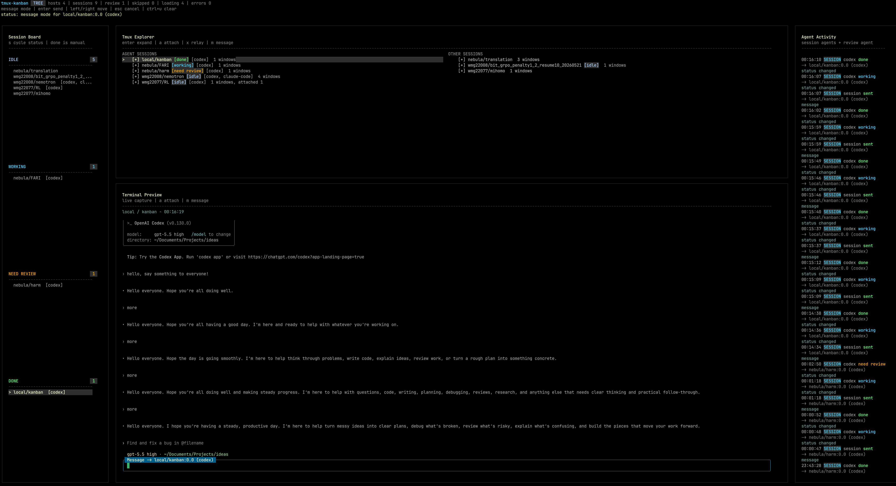

# tmux-kanban

用于监督本地和远程 tmux session 中长时间运行的 coding agent 的终端 kanban。

[English README](README.md)



tmux-kanban 是一个本地 TUI，用来跟踪多台机器上的 coding agent 会话、处理权限审批，并在 local / remote tmux session 之间协调工作。它主要为 Codex 和 Claude Code 准备。因为我现在用 Codex 更多，所以 Codex 的适配可能更充分一些，但 Claude Code 也是设计里的主要目标。

它解决的是我自己的一个很具体的痛点：我经常需要在多台 SSH 服务器上做持久化工作。对每台机器来说，tmux 已经足够好，可以让工作长期留在那里。真正糟糕的是，我需要在不同机器、不同 tmux session、不同 code agent 之间来回切换，只为了看一眼它是不是在等我、按一下 Enter、选一个选项、或者发一句短消息。我经常忘掉其中某个 agent，于是整体进度被我自己拖慢。

从效率视角看，我把这种状态叫做 human-bound vibe coding：agent 总是在等我。我的目标是 agent-bound vibe coding：大部分时候应该是我在等 agent。现在我感觉这个目标基本实现了。

Codex 和 Claude Code 都有 remote control 能力，但在我的环境里连接不够稳定，尤其是 Codex。前几天我被这个问题折磨得很厉害，这也是我做这个 kanban 的直接原因。tmux-kanban 没有使用 Codex 或 Claude Code 的 SDK，而是把 tmux 本身当成控制平面。

### 工作方式

核心实现很朴素，也很实用：

- 扫描本地和 SSH 上的 tmux host，把 session、window、pane 整理成一个 kanban cockpit。
- 主要通过终端文本 pattern matching 识别 Codex 和 Claude Code pane。
- 推断 session 当前是 `idle`、`working`、`need review` 还是 `done`。
- 用 `tmux capture-pane` 轮询 pane 来做 live preview。延迟是可见的，但对我的工作流来说可以接受。
- 按 `a` 可以直接进入 session，按 `m` 可以快速发消息，按 `1-9` 可以选择可见选项。
- 不需要手动切进 tmux，也可以向 agent pane 发送按键或消息。

我目前还没有系统测试过 tmux 分割 window 之类的复杂用法，因为我自己很少这么用。现在更可靠的是我日常会用到的 session / window / pane 路径。

### 能力概览

- 扫描本地和远程 SSH tmux host。
- 用 `idle`、`working`、`need review`、`done` 管理 session 状态。
- 为 Codex 和 Claude Code 的等待输入场景维护 focused review queue。
- 对选中的 session、window、pane 做 live terminal preview。
- 支持 attach、快速发消息、relay keys、数字选项选择。
- 提供 JSON CLI：review list、capture、choose、send、notify、snapshot。
- 可选 Hermes 集成，用于建议、手机远程工作和社交媒体通知。
- 提供 snapshot，方便 agent 基于证据 debug。
- 有实验性的 agent mesh scaffold，用于记忆、review advice 和未来的任务派发。

### Hermes 和 CLI

我另外做了 CLI，是为了方便自己在手机上通过 Hermes 和相应 skill 做远程工作。这个方向上，tmux-kanban 为 Hermes 提供核心能力：列出需要审批的项、抓取 pane、发送消息、选择选项、保存 snapshot。

反过来，Hermes 也为 tmux-kanban 提供能力：

- 在 review view 里按 `h`，可以参考 Hermes 对当前项的建议。
- 打开对应设置后，当 session 进入 review 状态时，可以自动询问 Hermes。
- 如果 Hermes 的回复足够明确，比如 `CHOOSE <number>` 或 `SKIP`，tmux-kanban 可以自动采纳。
- 如果遇到需要我本人介入的问题，Hermes 可以通过 QQ 之类的社交渠道通知我。

严格来说，现在的 review 更接近权限审批，而不是 code review。把审批交给 Codex 或 Claude Code 也很容易扩展，但我还没写，很大程度上是因为它们不能方便地通过社交媒体向我远程求助。

### 记忆和未来的任务派发

目前这个系统仍然在我的控制之下。它可以审批、协调 session，但我还没有让 agent 自由地把任务派发给别的 agent。从技术上说这个改动不大，但我现在还不想这样做：这些项目还不能完全脱离我的掌控，而且我也烧不起那么多 token 让它们夜以继日地工作。

不过我已经在为更自主的任务派发做准备。核心设计是多粒度记忆：指导信息可以存在于 global、host、session、window、pane 等不同层级。

```text
memory_root/
  global.md
  hosts/<host>/memory.md
  hosts/<host>/sessions/<session>/memory.md
  hosts/<host>/sessions/<session>/panes/<pane>/memory.md
  hosts/<host>/sessions/<session>/windows/<window>/memory.md
  hosts/<host>/sessions/<session>/windows/<window>/panes/<pane>/memory.md
```

现在这些 memory 主要用于影响 review advice。之后它也可以用于任务派发、总结、跨 session 协作。

某种意义上，我最后的愿景可能会有点像 [openai/symphony](https://github.com/openai/symphony)：从直接监督 coding agent，转向在更高层级管理要完成的工作。区别是 tmux-kanban 更个人化，也更围绕 tmux 和我的具体需求。我开始做 kanban 之后才看到 Symphony 开源，时机非常巧。

### Snapshot 和 Agent Debug

snapshot 是为了让行为可以被 debug，而不要求我自己读完整个代码库。一个 snapshot 会记录 config summary、host/session 拓扑、review queue、status map、当前 preview、最近扫描错误等信息。这样 coding agent 就能基于证据判断为什么某个 session 被标成 idle、working、need review 或 done。

这点对我很重要，因为这个项目本身就是 agent-assisted 的。我选择 Go 有一部分原因是我学过一点 Go，但实际上，我经常让 agent 看 snapshot 和测试来定位问题，而不是自己一行一行读源码。

### 名字

项目名确实很草率，已经被朋友吐槽过了。但我有起名困难症。至少这个名字很直接：tmux + kanban。

### 未来计划

近期计划主要是维护：修复真实使用中遇到的 bug，让状态识别少脆弱一点，并继续整理第一版能跑之后留下来的代码结构。对我自己的工作流来说，刚需的新特性其实已经不多了；这个工具已经覆盖了我最初想解决的主要痛点。

如果后面有时间，也许会继续做更好的 Codex / Claude Code 适配，支持更多 tmux layout，让 mesh 和 memory 部分更有用。不过一般这么说的东西都很容易变成长期 TODO，所以这更像方向，不是承诺。

### 快速开始

```bash
go run ./cmd/tmux-kanban
```

使用配置文件：

```bash
cp config.example.yaml config.yaml
go run ./cmd/tmux-kanban --config ./config.yaml
```

构建二进制：

```bash
go build -o ./bin/tmux-kanban ./cmd/tmux-kanban
```

### 本地配置

个人 host、SSH target、通知设置、本地 Hermes 路径和 snapshot 目录都应该放在 `config.yaml`。仓库只追踪 `config.example.yaml`。

```yaml
hosts:
  - name: local
    local: true
  - name: gpu-a
    ssh: user@gpu-a
```

### 快捷键

- `r` 扫描配置里的 tmux host。
- `:` 打开命令输入。
- `j` / `k` 或方向键移动光标。
- `enter` / `space` 展开或折叠 host、session、window。
- `s` 在 `idle`、`working`、`need review`、`done` 之间切换状态。
- `a` attach 到选中的 session、window 或 pane。
- `m` 给选中目标的第一个 agent pane 发送消息。
- `x` 给选中目标的第一个 agent pane relay selection keys。
- `tab` / `v` 在 tree view 和 focused review queue 之间切换。
- 在 review view 中，`h` 询问 Hermes，`1-9` 选择，`s` 跳过，`u` 恢复跳过项。
- `d` 保存 diagnostic snapshot。
- `q` 退出。

### TUI 命令

按 `:` 可以打开命令输入。命令输入支持候选提示；用 `up` / `down` 或 `ctrl+p` / `ctrl+n` 在候选之间移动，`tab` 接受候选，`enter` 执行，`esc` 或 `ctrl+c` 取消。

这些命令都是 runtime control，只影响当前运行中的 TUI 进程，不会改写 `config.yaml`。

通用导航和状态：

```text
:help
:refresh
:view tree
:view review
:status idle
:status working
:status need-review
:status done
:snapshot
```

`:refresh` 会重新扫描配置里的 tmux host。`:view` 在 tree 和 review queue 之间切换。`:status` 手动覆盖当前选中 session 的状态。`:snapshot` 保存 diagnostic JSON snapshot；如果没有直接写 description，TUI 会继续询问。

Hermes、QQ 和运行时设置：

```text
:settings
:set qq on
:set qq off
:set hermes on
:set hermes.auto_review on
:set hermes.done_advice on
:set hermes.auto_done on
:set hermes.idle_advice on
:set hermes.auto_idle on
:set hermes.auto_done all off
:set hermes.auto_done here off
:set hermes.auto_idle host gpu-a off
:set hermes.auto_idle host all off
:set hermes.auto_review session local/agents on
:notify optional message for Hermes
```

`:notify` 走配置里的 Hermes/QQ 通知路径，仍然需要 `notification.qq_enabled: true`。Hermes auto review 的策略故意比较保守：自动选择需要 Hermes 返回明确的 `CHOOSE <number>` 或 `SKIP`。
Hermes 设置支持全局默认，也支持 host/session 覆盖：`all on|off` 显式修改全局默认，`host <host|all> on|off` 影响某台机器或作为 scope 通配符，`session [host/]session|all on|off` 影响某个 session 或所有 session，`here on|off` 作用于当前选中的 session。done/idle next-step 也分成建议和自动采纳两层：`hermes.done_advice` / `hermes.idle_advice` 只让 Hermes 给出下一步建议，`hermes.auto_done` / `hermes.auto_idle` 只有在 Hermes 明确回复 `SEND: <message>` 时才会把消息发回对应 agent pane。
Hermes 的回复、自动采纳、跳过、发送下一步和 memory 写入都会追加到 `hermes.work_log`。默认路径是 `~/.local/state/tmux-kanban/hermes-worklog.jsonl`，用于后续人工审查。

Agent mesh 命令：

```text
:mesh status
:mesh on
:mesh off
:mesh default claude
:mesh shared off
:mesh skill-root ./mesh-skills
:mesh memory ~/.local/state/tmux-kanban/memory
:mesh policy review-advice backend claude
:mesh policy review-advice agent claude
:mesh policy review-advice skill review-advice
:mesh policy review-advice off
:mesh mail dir ~/.local/state/tmux-kanban/mail
:set mesh.mail on
:set mesh.memory_root ~/.local/state/tmux-kanban/memory
:memory update pane
:memory update session
```

mesh 命令目前主要是在运行时暴露 role、backend、skill、mail、memory 这些配置模型。`:memory update <global|host|session|window|pane>` 会抓取当前选中对象关联的 agent pane，使用 Hermes 和 `memory-summarizer` skill 生成对应 scope 的 `memory.md`。memory 和 review-advice 现在已经有实际用途；完整的自主任务派发仍然只是 scaffold，还不是完成的工作流。

### Agent CLI

```bash
./bin/tmux-kanban capabilities --config ./config.yaml
./bin/tmux-kanban review-list --config ./config.yaml
./bin/tmux-kanban review-list --config ./config.yaml --all --lines
./bin/tmux-kanban review-list --config ./config.yaml --notify --intent "tell me when an agent needs review"
./bin/tmux-kanban notify-review --config ./config.yaml --intent "daily agent review check"
./bin/tmux-kanban capture --config ./config.yaml --host local --target android:0.0
./bin/tmux-kanban choose --config ./config.yaml --host local --target android:0.0 --choice 1
./bin/tmux-kanban send --config ./config.yaml --host local --target android:0.0 --text "continue"
./bin/tmux-kanban send-keys --config ./config.yaml --host local --target android:0.0 --keys C-c,C-m
./bin/tmux-kanban snapshot --config ./config.yaml
```

`review-list` 默认返回当前 `need review` 的 pane。加上 `--all` 可以列出所有检测到的 Codex / Claude Code pane 及其推断状态。

### 架构

- `cmd/tmux-kanban`：TUI 和 JSON CLI 入口。
- `internal/core`：纯状态机和 review queue 逻辑。
- `internal/agent`：agent screen analysis、choices、targets、reviewer 概念。
- `internal/mesh`：role、scope、memory tree、a-mail scaffold。
- `internal/tmux`：tmux client 边界。
- `internal/tmuxscan`：tmux 命令解析和 screen detection。
- `internal/debug`：diagnostic snapshot writer。
- `internal/ui`：共享 TUI key/input primitives。
